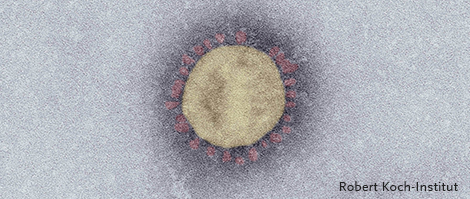
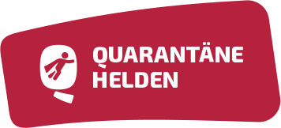

## Die Krise(n)

Vor etwa zwei Monaten kam mir die Idee einen persönlichen Blog zu schreiben. Eigentlich wollte ich diese Plattform nutzen, um Beiträge über den Klimawandel zu veröffentlichen. Insbesondere um den Einfluss jedes Einzelnen auf diese **Krise** zu thematisieren und Zusammenhänge zwischen Konsum und Klima herzustellen. 
Doch aktuell ist die Klimakrise medial in weite Ferne gerückte. Die Corona-**Krise** dagegen ist in aller Munde. Der Virus beherrscht unsere Medienlandschaft wie keine andere Katastrophe zuvor. Und auch ich widme meinen ersten Blogpost dieser Herausforderung.

## Die Fakten

Mittlerweile wird jeder etwas zu [COVID-19](https://www.ecdc.europa.eu/en/novel-coronavirus-china) bzw. dem Corona-Virus gehört haben oder ist direkt oder indirekt von dem Thema betroffen. Der Vollständigkeit halber - Chinesische Gesundheitsämter meldeten im Dezember 2019 mehere Fälle von aktuen Atemswegenproblemen in der Hubei-Provinz in China. Kurze Zeit später identifizierten die örtlichen Wissenschaftler, dass der Hauptgrund für die Atembeschwerden ein neuartiger Virus ist. Dieser Strang der *Coronaviridae* wurde zuvor bei keinem Menschen festgestellt. Seine Bezeichnung lautet *severe acute respiratory syndrome coronavirus 2* (SARS-CoV-2). Die Ansteckung und somit Krankheit an dem Virus wird als als *coronavirus disease 2019* (COVID-19) bezeichnet. Seit seiner Entdeckung im Dezember 2019 hat sich der Virus in seinem Ursprungsland China und anderen Teilen der Welt rasant ausgebreitet. Die Konsequenz - Die Weltgesundheitsorganisation (WHO) erklärte am 11.03.2020 den globalen Ausbruch des Virus offiziell als [Pandemie](http://www.euro.who.int/de/health-topics/health-emergencies/coronavirus-covid-19/news/news/2020/3/who-announces-covid-19-outbreak-a-pandemic).

## Die Reaktionen

Die Reaktionen auf die Virus sind gigantisch. In Italien & Spanien existieren Ausgangssperren. Einzelhändler werden um ihre Mehl- und Klopapier-Vorräte gebracht (BTW hauptsache ich kann mir in Zeiten der Krise der Hintern vierlagig abwischen & Non-Stop Brot backen). Menschen in Atemschutzmasken gehören zur Tagesordnung. Und auch in Deutschland hat uns die Bundeskanzelerin in ihrer Ansprache zur Lage der Nation dazu aufgefordert Maßnahmen zu ergreifen. Zwar existiert keine bundesweite Aussgangssperre (abgesehen von Bayern), aber unsere sozialen Kontakte sollen wir so weit wie möglich einschränken. Das öffentliche Leben ist größtenteils komplett zum Erliegen gekommen. Wir befinden uns demnach in einer Schutzquarantäne. So geht es mir zumindest, seitdem ich mich seit Beginn dieser Woche im Home-Office befinde. Und seither habe ich die Wohnung auch nur in ganz seltenen Fällen verlassen. 

## Die Chancen

Welche Chancen haben wir die Krise zu bewältigen? Zunächst kann **Jeder** einen Beitrag leisten. Vor allem indem man (soweit wie möglich) einfach zuhause bleibt und das Haus auch wirklich nur für die aller nötigsten persönlichen Bedürfnisse (Nahrung, Medikamente etc.) verlässt. Das allein hat schon gewaltigen Einfluss auf die Verbreitung des Virus. **Und man kann noch mehr machen**.

### Schafft Abstand (nicht nur körperlich)

Zwar befinden wir uns in einer schnelllebigen Zeit, in der jeder mit seinen eigenen Herausforderungen & Problemen zur Genüge beschäftigt ist. Doch gerade in Zeiten der Krise sollte jeder die Möglichkeit haben Abstand vom Alltag zu gewinnen. Denkt nicht an euren üblichen Tagesablauf aus Arbeit, Fitnessstudio, Freizeitaktivitäten etc. nach. Wir befinden uns im Ausnahmezustand. Macht euch das bewusst - aber bleibt bei Verstand.  Das schafft Blick für das große Ganze. Und es macht Raum für neue Ideen, wie ihr euren Beitrag leisten könnt (in meinem Fall ist dieser Blogbeitrag entstanden). So fällt euch zwangsläufig auch nicht die Decke auf den Kopf, wenn ihr nicht euren gewohnten Aktivitäten nachkommen könnt.

### Setzt eure Fähigkeiten ein

Für Technik-Liebhaber (wie mich) sind  Projekte wie der [#WirVsVirus-Hackathon](https://wirvsvirushackathon.org/mitmachen/) oder [CORD-19](https://www.kaggle.com/allen-institute-for-ai/CORD-19-research-challenge) unheimlich interessant, weil sie mir die Möglichkeit geben, mit meinem Wissen und meinen Fähigkeiten zur Krisenbewältigung beizutragen. Ich persönlich nehme an dem Hackathon teil. Aber selbstverständlich kann man auch unabhängig von irgendwelchen Hackathons oder Wettbewerben seinen Beitrag leisten. Ob es nun irgendwelche neuen Verfahren für den (öffentlichen) Alltag oder vielleicht Prozessverbesserungen für eure Arbeitskollegen sind - Alles was die Verbreitung des Virus eindämmt oder unseren Ausnahme-Alltag erleichtert **ist** hilfreich. Seid kreativ!

### Zeigt Hilfsbereitschaft 

Natürlich muss man kein Computer-Spezialist sein oder besondere Fähigkeiten haben, um einen Beitrag zu leisten. Oft sind es auch einfach die kleinen Dinge, die Großes bewirken. Helft euren Geschwistern, Eltern, Mitbewohnern, Nachbarn oder vielleicht sogar Fremden in Not. Bei [Quarantäne Helden](https://www.quarantaenehelden.org/#/) könnt ihr Menschen in eurer Umgebung finden, die diese Hilfe wirklich brauchen. Wir befinden uns alle in dieser Krise. Und einige von uns trifft sie härter als andere.

### Reflektiert euer Konsumverhalten

Wie eingangs erwähnt, wollte ich diesen Blog eigentlich dazu nutzen um unser Konsumverhalten in Bezug auf den Klimawandel zu schreiben. Auch wenn der Fokus ein anderer ist - Dieses Thema hat in dieser Krise auch einen hohen Stellenwert. Denn was aktuell in unseren Supermärkten passiert ist unglaublich. Morgens zum Klopapier-Regal zu rennen, um einen Stappel Rollen zu ergatern, ist neuer Volkssport geworden. Aber wieso eigentlich? Schließlich bleibt unsere Grundversorgung doch erhalten. Sollte jeder also seinem üblichen Konsum folgen, würde die Versorgung weiterhin reibungslos funktionieren. Durch dieses übermäßige Horten von Waren nehmt ihr den Menschen, die weiter ihrer Beschäftigung folgen, um unsere medizinische Versorgung & Infrastruktur aufrecht zu erhalten, die Möglichkeit über normale Wege die notwendige Grundversorgung zu erhalten. Man male sich aus, welchen Rückkopplungseffekt ein Ausfall dieses Bevölkerungsteils hat ("Wie gut kann man Brot ohne Strom für den Backofen eigentlich backen?"). Macht euch ernsthaft Gedanken über euren Konsum und kauft nur das was ihr wirklich braucht. Am besten regional, um Lieferketten kurz zu halten und die Verbreitung des Virus auf diesem Wege zu reduzieren.

### Denkt an die Zukunft

Wenn wir die aktuelle Entwicklung betrachten, stehen wir noch weit am Anfang der COVID-19-Pandemie. Wir sollten gerade jetzt zeigen, dass wir in der Lage sind, diese Krise **gemeinsam** und **solidarisch** zu bewältigen. Denn wer weiß wann uns die nächste Krise bevorsteht (bzw. wir uns nicht schon in einer größeren Krise befinden...). Dann sollten wir zumindest eine gute Blaupause haben, wie wir auch die nächste Krise erfolgreich meistern können. Jetzt haben wir die Chance!

***

 **Bild-Quellen**

 [1] [virus.jpg](https://www.rki.de/SharedDocs/Bilder/InfAZ/neuartiges_Coronavirus/EM_Covid_19_koloriert_Krankheitsseite.jpg?__blob=normal&v=6)

 [2] [merkel.jpg](https://cdn.prod.www.spiegel.de/images/0e01f0a5-80e5-4084-9a42-9feab3899ff3_w948_r1.77_fpx55.33_fpy54.97.jpg)

 [3] [hackathon.jpg](https://wirvsvirushackathon.org/wp-content/uploads/2020/03/12-scaled.jpg) 

 [4] [helden.png](https://www.quarantaenehelden.org/static/media/logo.c3831aea.svg)

