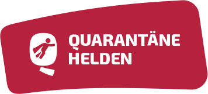

## Die Krise(n)

Vor etwa zwei Monaten kam mir die Idee einen persönlichen Blog zu schreiben. Eigentlich wollte ich diese Plattform nutzen, um über den Klimawandel zu schreiben. Insbesondere wollte ich den Einfluss jedes Einzelnen auf diese **Krise** thematisieren und Zusammenhänge zwischen Konsum und Klima herstellen. 
Doch aktuell ist die Klimakrise medial in weite Ferne gerückte. Die Corona-**Krise** dagegen ist in aller Munde. Der Virus beherrscht unsere Medienlandschaft wie keine andere Katastrophe zuvor. Obwohl es sich dabei *in my humble opinion* (IMHO) um das "kleinere Übel" handelt, widme ich meinen ersten persönlichen Blogpost dennoch dieser Herausforderung.

## Die Fakten

Mittlerweile sollte **allen** klar sein was [COVID-19](https://www.ecdc.europa.eu/en/novel-coronavirus-china) ist. Der Vollständigkeit halber - Chinesische Gesundheitsämter meldeten im Dezember 2019 mehere Fälle von aktuen Atemswegenproblemen in der Hubei-Provinz in China. Kurze Zeit später identifizierten die örtlichen Wissenschaftler, dass der Hauptgrund für die Atembeschwerden ein neuartiger Virus ist. Dieser Strang der *Coronaviridae* wurde zuvor bei keinem Menschen festgestellt. Seine Bezeichnung lautet *severe acute respiratory syndrome coronavirus 2* (SARS-CoV-2). Die Ansteckung und somit Krankheit an dem Virus wird als als *coronavirus disease 2019* (COVID-19) bezeichnet. Seit seiner Entdeckung im Dezember 2019 hat sich der Virus in seinem Ursprungsland China und anderen Teilen der Welt rasant ausgebreitet. Die Konsequenz - Die Weltgesundheitsorganisation (WHO) erklärte am 11.03.2020 den globalen Ausbruch des Virus offiziell als [Pandemie](http://www.euro.who.int/de/health-topics/health-emergencies/coronavirus-covid-19/news/news/2020/3/who-announces-covid-19-outbreak-a-pandemic).

## Die Reaktionen

Die Reaktionen auf die Virus sind gigantisch. In Ländern wie Italien & Spanien existieren Ausgangssperren. Einzelhändler werden um ihre Mehl- und Klopapier-Vorräte gebracht (BTW hauptsache ich kann mir in Zeiten der Krise der Hintern vierlagig abwischen & Non-Stop Brot backen). Menschen in Atemschutzmasken gehören zur Tagesordnung. Und auch in Deutschland hat uns die Bundeskanzelerin dazu aufgefordert Maßnahmen zu ergreifen. Zwar existiert keine offizielle Aussgangssperre, aber unsere sozialen Kontakte sollen wir so weit wie möglich einschränken. Wir befinden uns in einer Schutzquarantäne. So geht es mir zumindest, seitdem ich mich seit Beginn dieser Woche im Home-Office befinde. Und seither habe ich die Wohnung auch nur in ganz seltenen Fällen verlassen. 

## Die Chanche(n)

Welche Chance haben wir nun eigentlich? Naja, so einige! Zunächst kann **Jeder** seinen Beitrag leisten. Vor allem indem man (soweit wie möglich) einfach zuhause bleibt und das Haus auch wirklich nur für die aller nötigsten persönlichen Bedürfnisse (Nahrung, Medikamente etc.) verlässt. Das allein hat schon gewaltigen Einfluss auf die Verbreitung des Virus.

Aber was sollen wir mit der ganzen Zeit zuhause anfangen? Schließlich ist man irgendwann mit allen Serien bei Netflix, allen Videospielen an der PlayStation, mit allen Büchern im Regal auch durch und hat jedes Gespräch bezüglich der Krise geführt. Die Langweile setzt ein und der Wunsch nach neuen Aktivitäten macht sich breit. **Und die gibt es**. 

### Schafft Abstand (nicht nur körperlich)

Zwar befinden wir uns in einer schnelllebigen Zeit, in der jeder mit seinen eigenen Herausforderungen & Problemen zur Genüge beschäftigt ist. Doch gerade in Zeiten der Krise sollte jeder die Möglichkeit haben Abstand zu gewinnen. Das schafft Blick für das große Ganze und Raum für neue Idee, wie ihr in Zeiten der Krise helfen könnt.

### Setzt eure Fähigkeiten ein

Für Technik-Liebhaber (wie mich) sind  Projekte wie der [#WirVsVirus-Hackathon](https://wirvsvirushackathon.org/mitmachen/) oder [CORD-19](https://www.kaggle.com/allen-institute-for-ai/CORD-19-research-challenge) unheimlich interessant, weil sie mir die Möglichkeit geben, mit meinem Wissen und meinen Fähigkeiten zur Krisenbewältigung beizutragen. Aber selbstverständlich kann man auch unabhängig von irgendwelchen Hackathons oder Wettbewerben seinen Beitrag leisten. Ob es nun irgendwelche neuen Verfahren für den (öffentlichen) Alltag oder vielleicht Prozessverbesserungen für eure Arbeitskollegen sind - Alles was die Verbreitung des Virus eindämmt **ist** hilfreich. Seid kreativ!

### Zeigt Hilfsbereitsschaft

Aber natürlich muss man kein Computer-Spezialist sein oder besondere Fähigkeiten haben, um einen Beitrag zu leisten. Oft sind es auch einfach die kleinen Dinge, die Großes bewirken. Helft euren Geschwistern, Mitbewohnern, Nachbarn oder vielleicht sogar Fremden in Not. Bei [QuarantäneHelden](https://www.quarantaenehelden.org/#/) könnt ihr Menschen in eurer Umgebung finden, die diese Hilfe wirklich brauchen.

### Denkt an die Zukunft

Wir sollten gerade jetzt zeigen, dass wir in der Lage sind, diese Krise **geminsam** und **solidarisch** zu bewältigen. Denn wer weiß wann uns die nächste Krise bevorsteht (bzw. wir uns nicht schon in einer größeren Krise befinden)... Dann sollten wir zumindest eine gute Blaupause haben, wie wir auch die nächste Krise erfolgreich meistern können. Jetzt haben wir die Chance!

